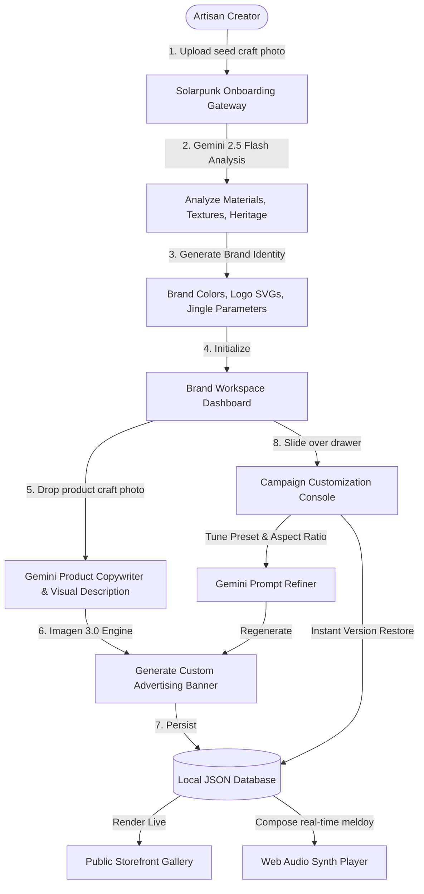

# 🌿 Zero-to-Brand: The Solarpunk Multi-Product Campaign Engine

**Zero-to-Brand** is an autonomous design co-pilot and marketing engine tailored for modern artisan creators. It shifts the paradigm from generic product listing sites to premium, brand-aligned visual storytelling ecosystems.

By combining **Gemini 2.5 Flash** visual parsing, **Imagen 3** high-fidelity image rendering, and **Web Audio API** procedural synthesizers, the app helps physical makers turn raw craft photos into a cohesive brand identity, a complete campaign storefront, and a matching sonic signature in seconds.

## 🏆 Competition
- **Hackathon**: [Ship to Get Hired - Gappy AI Hackathon](https://unstop.com/hackathons/gappy-ai-hackathon-gappy-ai-1694233)
- **Tracks**: AI Product Engineer / AI Product Manager
- **Prizes Targeted**: ₹1 Lakh (1st Prize: ₹50,000, 2nd: ₹30,000, 3rd: ₹20,000)
- **Platform**: [Unstop](https://unstop.com/hackathons/gappy-ai-hackathon-gappy-ai-1694233)

---

## 🎨 Solarpunk Design & Philosophy
The project embraces a **Solarpunk** aesthetic—celebrating local, sustainable craftsmanship, organic eco-technology, and harmony with nature. 

The interface features:
- A curated natural color palette (sage greens, warm sunflower accents, cream bases).
- Premium typography pairing serif display headings with clean geometric labels.
- Soft glassmorphism container styles, smooth transitions, and organic borders.
- Procedural, ambient sound identities matching the brand's aesthetic dials.

---

## 📐 Architecture & Workflow



---

## ✨ Key Features

### 1. Solarpunk Gateway & Wizard Onboarding
Creators can log into established brand vaults or drop a signature craft photo (e.g., a glazed ceramic vase) to start a new brand. Gemini automatically extracts:
- **Materials** (clay, stone, brass)
- **Textures** (rough, glossy, sand-blasted)
- **Craftsmanship** (hand-painted, wheel-thrown, hand-forged)
- **Detailed Visual Description** used to condition Imagen generations.

### 2. Multi-Product Sandboxed Workspace
Organize multiple product campaigns inside a clean, responsive dashboard. Adding a product generates customized copywriting (Name, Tagline, Description) and a dedicated advertisement banner.

### 3. Visual Conditioning Banner Generator
Unlike naive prompt generators, Zero-to-Brand first extracts a comprehensive visual description (`imagenPromptDescription`) using Gemini 2.5 Flash and injects it as the core subject in the Imagen 3 prompt. This ensures the campaign banners actually depict the textures, colors, and glazes of the creator's real physical craft, rather than generic placeholders.

### 4. Interactive Campaign Console Drawer
Slide out the editor panel to tweak campaign text in real-time or fine-tune visuals:
- **Aspect Ratio Selector**: Generate banners optimized for `16:9 Wide` (landings), `1:1 Square` (socials), `9:16 Story` (mobile campaigns), or `4:3 Classic` (showcases).
- **Style Presets**: Apply moods like **Solarpunk** (eco-bright), **Cyberpunk** (neon night), **Minimalist** (diffused beige studio), **Vintage** (retro wooden table), and **Cozy** (cinematic sun flare).
- **Banner History Strip**: Review thumbnails of all generated versions for a product. Clicking any version swaps the active banner immediately with full database persistence.

### 5. Procedural Sonic Branding
Listen to a real-time synthesized musical theme generated based on the brand's aesthetic dials. The Web Audio synthesizer dynamically structures tempos, scale structures (Major, Minor, Pentatonic), and pluck instruments (Acoustic, Bell, Warm Synth) in the workspace and public storefront.

---

## 🛠️ Technical Stack

- **Framework**: Next.js 16 (App Router, Turbopack, Tailwind CSS v4)
- **AI Engine**: Google Gen AI SDK (`@google/genai`)
  - **Gemini 2.5 Flash**: Visual analysis, copywriting, and prompt refinement.
  - **Imagen 3.0** (`imagen-3.0-generate-002`): High-fidelity logo and campaign banner generation.
- **Audio Engine**: Web Audio API (procedural music synthesizer)
- **Database**: Local JSON Database with automatic schema migrations.

---

## 🚀 Getting Started

### 1. Environment Configuration
Create a `.env.local` file in the root directory:
```bash
GEMINI_API_KEY=your_gemini_api_key_here
```
*Note: If no API key is provided, the application runs in a simulated sandbox mode with pre-baked assets so judges can test all features without key dependency.*

### 2. Install Dependencies
```bash
npm install
```

### 3. Start Development Server
```bash
npm run dev
```
Open [http://localhost:3000](http://localhost:3000) to view the application.

### 4. Build and Compile Verification
```bash
npm run build
```
The project compiles statically and dynamically, ensuring all TypeScript definitions and App Router routes are fully optimized.

---

## 🤖 AI Developer Notes

### Context & Second Brain Mapping
- **Second Brain Notes**: Review active tasks and Solarpunk branding goals under:
  [Ctx - Zero-to-Brand Context](file:///home/deu/Documents/Technical%20&%20Academins/10%20AI/Context/Coding%20Repos/Zero-to-Brand/Ctx%20-%20Zero-to-Brand%20Context.md) and [Ctx - Zero-to-Brand Inbox](file:///home/deu/Documents/Technical%20&%20Academins/10%20AI/Context/Coding%20Repos/Zero-to-Brand/Ctx%20-%20Zero-to-Brand%20Inbox.md).

### Codebase Invariants
- **Next.js 16 App Router & React 19**: This project uses the new Next.js 16 compiler and React 19 rules. Follow modern async Server Actions and React Server Components (RSC) patterns.
- **Google Gen AI SDK Wrapper**: Use the official `@google/genai` library client. Do not use legacy `@google/generative-ai` packages. All API requests should route through `src/lib/gemini.ts` (or equivalent SDK initialization helper).
- **Audio Synthesizer Controls**: The sonic branding logic uses standard browser-native Web Audio API oscillators. Keep synthetic parameters scoped to the user interface dials to prevent browser audio blockage policies before user interaction.
- **Local Persistence Schema**: Campaign state is written to a JSON database file. Ensure that database schema migrations execute on app bootstrap inside API setup handlers.

